[About](.) | [Mobile](mobile.html) | [Toys](toys.html) | [Discord](https://discord.gg/SHJMjEh9VH)

# FBC - For Better Club (formerly BCE - Bondage Club Enhancements)

This addon to [Bondage Club](https://www.bondageprojects.com/club_game/) offers various mostly small improvements to the game experience. Making the game easier, safer and, in some cases, more immersive for certain types of people. See features below for more details.

## How to install and use

Install via [FUSAM](https://sidiousious.gitlab.io/bc-addon-loader/)

## Features

At a glance, **everything is entirely optional, enable in settings** (profile -> preferences -> FBC Settings):

- Integration with remote controlled sex toys that work with [buttplug.io](https://buttplug.io) ([Instructions](toys.html))
- Improved automatic facial expressions that play nice with manual control
- Automatic relogin after disconnect
- FPS limiter: save your computer's resources
- Addon loader for other addons ([BCX](https://github.com/Jomshir98/bondage-club-extended), [EBCH](https://e2466.gitlab.io/ebch/)), [MBS](https://github.com/bananarama92/MBS), [LSCG](https://github.com/littlesera/LSCG/wiki)
- Clickable links and embedded images from trusted websites in chat (e.g. imgur, Discord)
- Lockpicking helper
- Convenient chat commands, such as `/w <name> <message>` to whisper another player
- Full wardrobe in chatrooms (preview before saving/loading).
- Anti-garble for gagspeak and deafening
- Anti-anti-garble for your own speech: prevent others from understanding you with anti-garbling solutions while gagged
- Alternative arousal calculations
- Blur vision when not wearing glasses
- Notifications for friends coming online or going offline
- Confirmation prompt when leaving the page
- Beeps display their text in chat. Clicking on them takes you directly to the beep.
- Ctrl+Enter to OOC
- Accurate timer inputs
- Club slave as an option for owners under forced labor
- Extended Wardrobe (more slots)
- Modify outfit layering
- Importing and exporting outfits
- Change your nickname
- Save and review profiles of, and add notes to, players you have seen before (incompatible with incognito/private browsing due to saving in browser storage) - /profiles to search them
- Basic anti-cheat

### Chat Links and Embeds

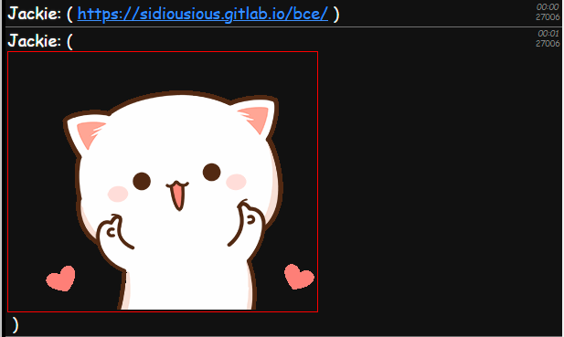

FBC allows clicking links posted in chat and embeds images from trusted domains, such as Discord, Imgur and Tenor. Additionally any links you send will always be inside OOC brackets to ensure stutter algorithms do not break your links.

### Instant Messenger

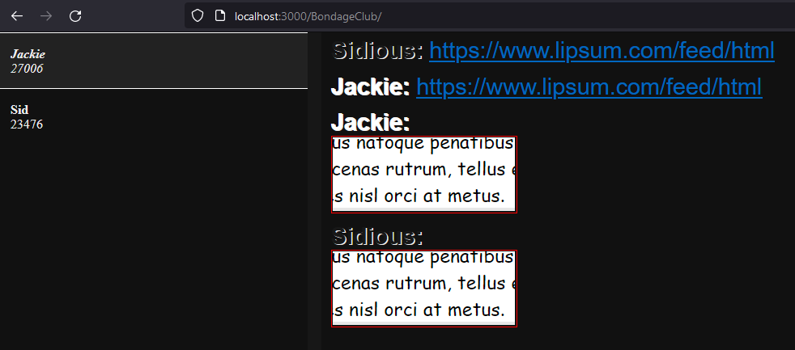

FBC includes an optional instant messenger that can be used to message with your friends.

### Require Glasses to See

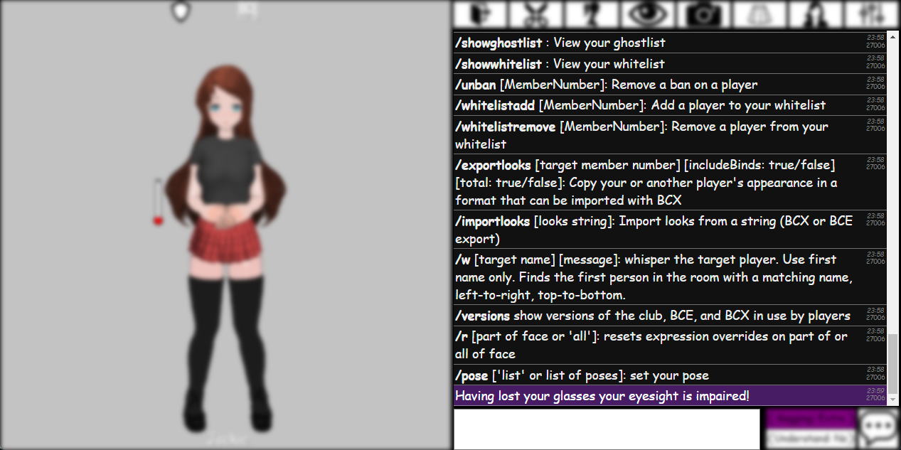

FBC can blur your vision, when your character is not wearing glasses or visors.

### Confirm Leaving the Club

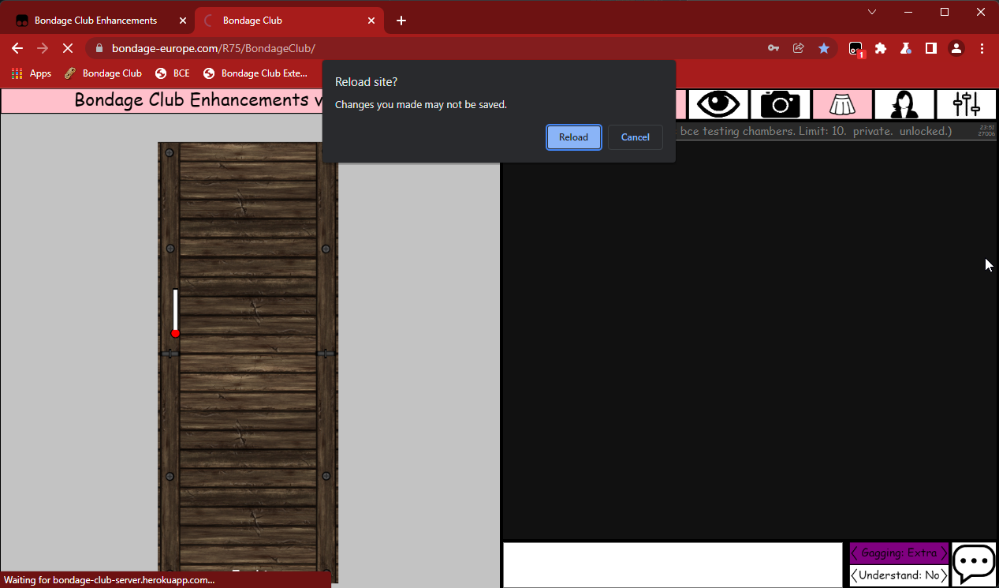

FBC can ask you to confirm when navigating away from the club. This protects against accidental back button or refresh. Best combined with saved credentials for automatic relogin, as relogin will still be required.

### Lockpick Helper

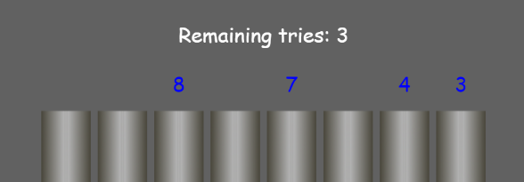

FBC can give hints in the lockpicking minigame, based on your skill. Do note that lockpicking can still be impossible, if you are tied up too tightly or your skill is too low.

### Full Wardrobe in Chatrooms

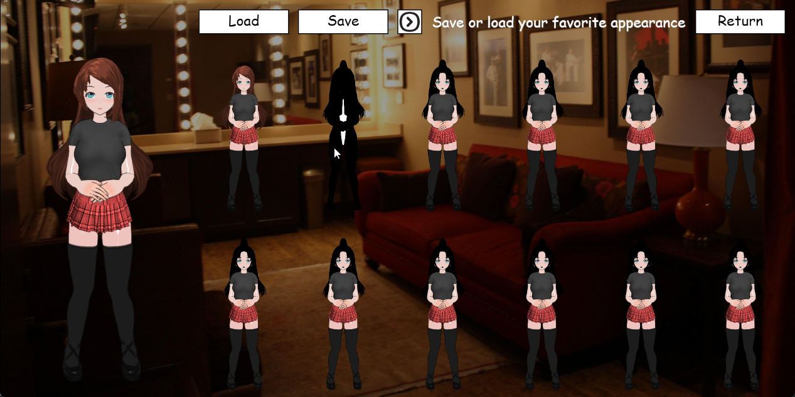

FBC can allow using the full wardrobe with previews from the singleplayer private room inside online chatrooms.

### Additional Chat Commands for Convenience

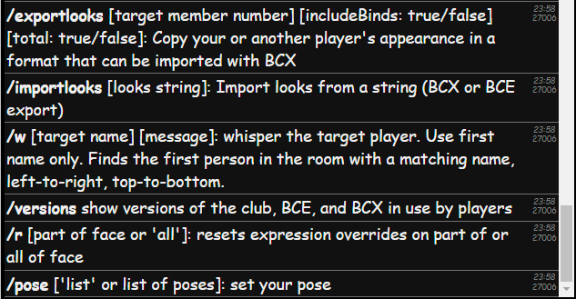

- `/exportlooks <member number> <include restraints: true/false> <include body, eyes, etc: true/false>` allows you to save your or another player's last seen appearance as a string you can later import with BCX or on yourself `/importlooks`. If no member number is given, copies your own appearance. Additional parameters default to "false".
- `/importlooks [looks string]` sets your current appearance to the copied appearance.
- `/w [target's first name] [message]` sends a whisper to the target. No message will be sent if the target cannot be found or if many people with the same name are present in the room. No more danger of the other player disconnecting and you uttering the message out loud in public.
- `/versions` show what versions of BC, BCX and FBC other players in the room are using.
- `/r` resets animations and expressions. You can optionally define part of the face to reset, leaving other parts intact, e.g. `/r eyes`
- `/pose <space separated list of poses>` allows setting or resetting your character's pose. Note that this bypasses restrictions, but will not override poses imposed by items, e.g. short collar chain.
- `/pose list` lists all available poses.

### Friend Presence Notifications

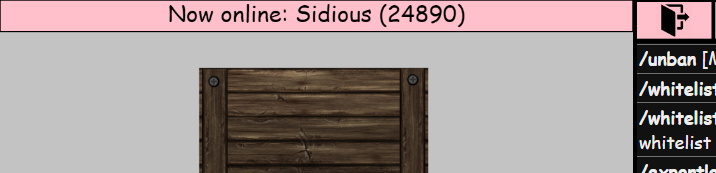

FBC can notify you when friends come and go.

### Beep Enhancements

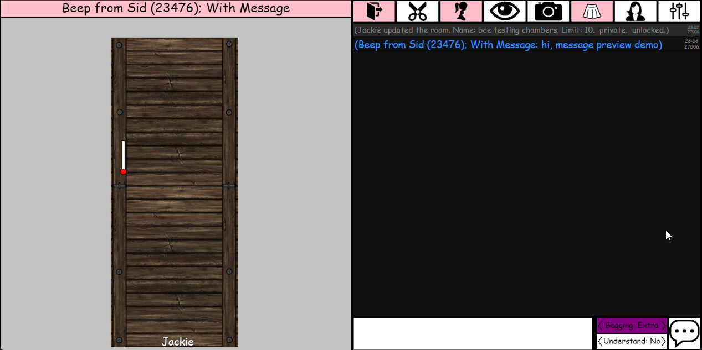

FBC will display a snippet of the message received in beeps in chat, and clicking the message takes you directly to the beep. This functionality is incompatible with BcUtil and disabled, when that addon is detected.

### Accurate Timer Durations

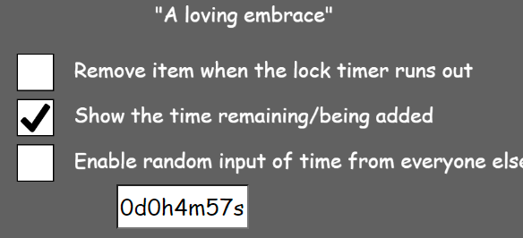

FBC allows you to set timer locks at a greater accuracy. Does not allow exceeding maximum duration of the locks.

### Automatic relogin

FBC can automatically enter your password, when you lose connection to the game. You can enable this by choosing to save your login after entering your details, but before clicking login, by clicking on the "Save (FBC)" button. You can then populate the login by pressing the name on the left for future logins, and remove it there, also disabling the auto-relogin. **Warning**: this does store your password in plaintext in your local storage, where malicious scripts could theoretically read it.

### Forced Labor: Club Slave

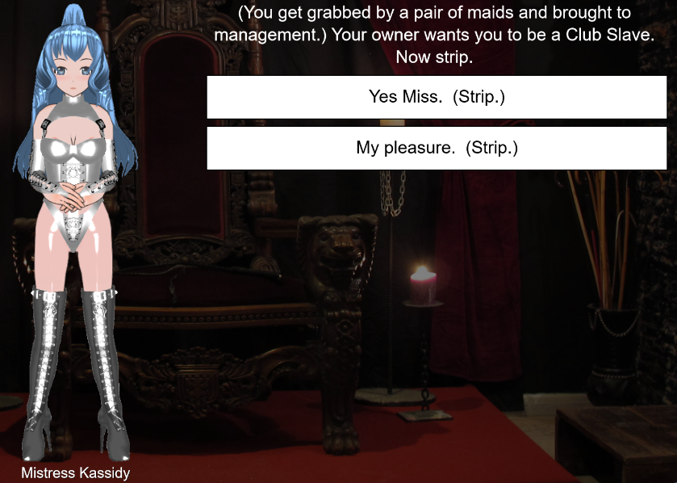

FBC allows owners to send their submissives to work as club slaves, when both are running the supported versions of FBC.

### Extended Wardrobe

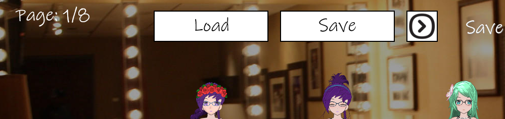

FBC allows expanding your wardrobe to 96 slots. Note that this will make the wardrobe open a bit slower.

### Layer-priority editor and ability to loosen/tighten restraints

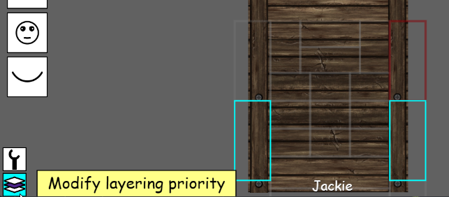
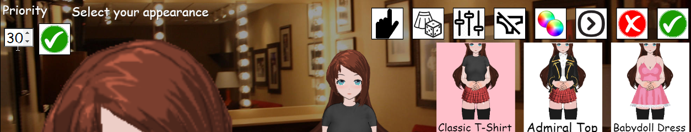

FBC allows manual editing of an asset's priority — the value the game uses to decide what item shows over others. When you select an item, you should see either:

- a number field and a validate button at the top-right for clothing,
- two white boxes at bottom-left for restraints: one will open the option to modify layer priority while the other allows loosening/tightening restraints.

This allow manually overriding the assets' relative positioning, giving better flexibility when doing outfits, or slapping restraints. Note that there's no way to reset the priority to its default value, so you have to take note of it or take it off and put it on again.

### Anti-cheat

FBC can be set to prevent certain console-based cheats from impacting your character and allows you to optionally blacklist detected bad actors automatically.

### Customizable automated expressions

FBC has an expression animator that replaces the game's default animator. It uses both the arousal meter, and messages posted in chat, and respects manual changes you make to your face (not overriding them every 2 seconds like the game's own face animator).

Yield control of manual expressions back to the automator by using the chat command `/r`, or you can choose which part of your face to give back e.g. `/r eyes`.

#### Arousal expressions

Arousal-based expressions are just that: your facial expression will change depending on changes to your arousal. This is compatible with both manual and automatic arousal meter. For customization refer to the comments in the example script [`bce-custom-expressions-example.user.js`][custom], which you can separately install via Tampermonkey. Advanced users can host their own bookmarklet for it.

#### Event-driven expressions

Messages in chat can trigger animations on your face. These can vary from the (click actions) to \*roleplayed /me\* messages.

#### Alternative arousal calculations

The arousal system in the game is very basic and regardless of the action your arousal will go up 1% per second. This alternate system changes it to be 0.25-2% per second depending on the activity, number and intensity of vibrators, how much you love the activity and the part of the body it's occurring in. Overall this should result in _slightly_ faster orgasms from loved activities and stacked maxed vibrators while significantly slowing down arousal increase from less loved activities. Your arousal settings are fully respected by these changes.

**Note**: you may see some flickering on the arousal meter when one player is using this while the other one is not.

### Expression cheatsheet

This is for the purposes of customizing [`bce-custom-expressions-example.user.js`][custom]. The lists are in the same order as the menu in the game for the purposes of knowing which is which.

```js
  Eyes: [
    "Closed",
    "Dazed",
    "Shy",
    "Sad",
    "Horny",
    "Lewd",
    "VeryLewd",
    "Heart",
    "HeartPink",
    "LewdHeart",
    "LewdHeartPink",
    "Dizzy",
    "Daydream",
    "ShylyHappy",
    "Angry",
    "Surprised",
    "Scared",
  ],
  Eyes2: [], // Same as Eyes above
  Mouth: [
    "Frown",
    "Sad",
    "Pained",
    "Angry",
    "HalfOpen",
    "Open",
    "Ahegao",
    "Moan",
    "TonguePinch",
    "LipBite",
    "Happy",
    "Devious",
    "Laughing",
    "Grin",
    "Smirk",
    "Pout",
  ],
  Blush: ["Low", "Medium", "High", "VeryHigh", "Extreme", "ShortBreath"],
  Fluids: [
    "DroolLow",
    "DroolMedium",
    "DroolHigh",
    "DroolSides",
    "DroolMessy",
    "DroolTearsLow",
    "DroolTearsMedium",
    "DroolTearsHigh",
    "DroolTearsMessy",
    "DroolTearsSides",
    "TearsHigh",
    "TearsMedium",
    "TearsLow",
  ],
  Emoticon: [
    "Afk",
    "Whisper",
    "Sleep",
    "Hearts",
    "Tear",
    "Hearing",
    "Confusion",
    "Exclamation",
    "Annoyed",
    "Read",
    "RaisedHand",
    "Spectator",
    "ThumbsDown",
    "ThumbsUp",
    "LoveRope",
    "LoveGag",
    "LoveLock",
    "Wardrobe",
    "Gaming",
  ],
  Eyebrows: ["Raised", "Lowered", "OneRaised", "Harsh", "Angry", "Soft"],
```

[View source code and contribute on GitLab](https://gitlab.com/Sidiousious/bce)

[Credits](https://gitlab.com/Sidiousious/bce/-/graphs/main), and:
- Chinese localization by 洛星臣

[custom]: https://sidiousious.gitlab.io/bce/bce-custom-expressions-example.user.js
[bookmarklet]: javascript:(()%3D%3E%7Bfetch('https%3A%2F%2Fsidiousious.gitlab.io%2Fbce%2Fbce.user.js').then(r%3D%3Er.text()).then(r%3D%3Eeval(r))%3B%7D)()%3B
